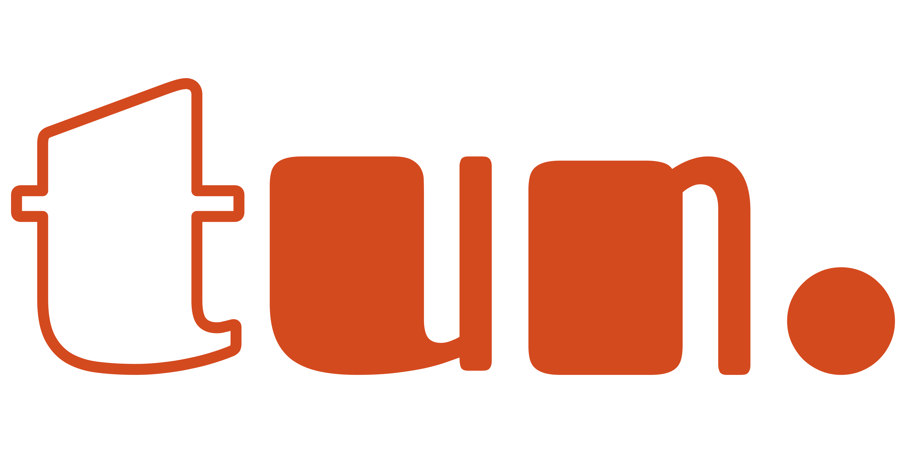

<div align="center">



<br/>
<h4>Rust REST Template 🏗️</h4>

<a href="https://github.com/azzamsa/tun/actions/workflows/ci.yml">
    
  </a>

</div>

---

## Features

- [Axum](https://github.com/tokio-rs/axum): web framework.
- [utoipa](https://github.com/juhaku/utoipa): automatically generates OpenAPI documentation.
- [SQLx](https://github.com/launchbadge/sqlx): SQL toolkit.
- [Tracing](https://github.com/tokio-rs/tracing): includes local timestamps.
- [git-cliff](https://github.com/orhun/git-cliff): Changelog Generator.
- Includes exhaustive integration tests.
  - Uses [Hurl](https://github.com/Orange-OpenSource/hurl) for API collection.
- Utilizes fast and tiny image containers, leveraging [cargo-chef](https://github.com/LukeMathWalker/cargo-chef) and `scratch` or `distroless` images.
- Implements GitHub Actions for CI and release workflows.
- Ensures consistent formatting using [dprint](https://github.com/dprint/dprint) for non-Rust files (Markdown, Dockerfiles, etc.).
- Includes [cargo-release](https://github.com/crate-ci/cargo-release) workflow.

## Checklist

When you use this template, try to follow the checklist to update your info properly

- [ ] Change the author name in `LICENSE`
- [ ] Change the package info in `Cargo.toml`
- [ ] Change the application name:
  - [ ] Database name and other values in `.env`, `.example.env`, and other container related files.
  - [ ] The OpenAPI info in `routes.rs`
  - [ ] App name in `release.yml`
  - [ ] Project URL in `.cliff.toml`
  - [ ] App name in the import statements across Rust source and tests files.
- [ ] Clean up the READMEs and remove routes

And, enjoy :)

## Usage

```shell
$ # Clone the repository

$ touch $SCHEMA_LOCATION # See .example.env
$ just dev  # See also `just setup`
```

Go to the playground `http://127.0.0.1:8000/swagger` to see the schema.

## Navigating the Code

All the features can be found in the [CHANGELOG](CHANGELOG.md) file tagged with `feat`.
The file only contains user-facing changes, so you won't get lost navigating the code.
